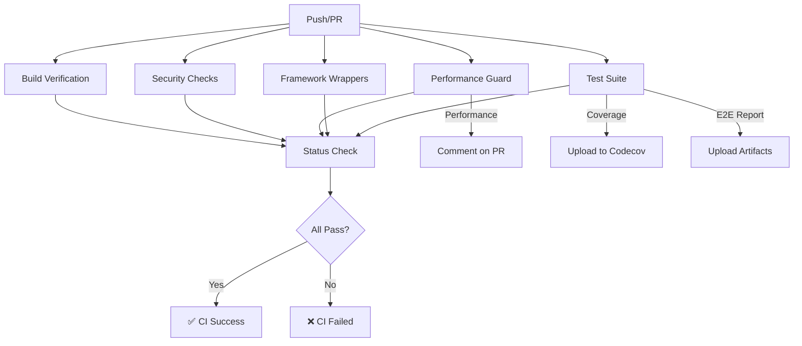

# GitHub Actions CI/CD Pipeline

## Quick Reference

### What Runs Automatically

**On every push to `main` or `develop`:**
- ✅ Unit tests (Node 18.x & 20.x)
- ✅ E2E tests (Playwright + Chromium)
- ✅ Framework wrapper tests (React/Vue/Angular/Svelte)
- ✅ Performance regression checks
- ✅ Security scans (npm audit + Snyk)
- ✅ Build verification
- ✅ Coverage reporting

**On every pull request:**
- ✅ All of the above
- ✅ Performance results commented on PR
- ✅ Coverage diff report
- ✅ Build artifact validation

### Performance Thresholds

The CI will **fail** if these are exceeded:

| Benchmark | Threshold | Current |
|-----------|-----------|---------|
| Populate 5000 cells | 1000ms | ~500ms ✅ |
| Evaluate 1000 formulas | 500ms | ~200ms ✅ |
| Retrieve 10000 cells | 200ms | ~50ms ✅ |

### Test Coverage

**Current:** ~25% overall, 52% FormulaEngine  
**Target:** 70% minimum, 80% goal

### Local Development Commands

```bash
# Run all tests (like CI)
npm test                    # Unit tests
npx playwright test         # E2E tests
npm run bench              # Performance benchmarks
npm run security:audit     # Security scan

# Simulate full CI pipeline
npm run typecheck && \
npm run build && \
npm test -- --ci --coverage && \
npx playwright test
```

### CI Pipeline Flow



### What Gets Tested

#### Unit Tests
- ✅ Core: VersionManager, FormulaEngine, Worksheet
- ✅ Renderer: CanvasRenderer with mocked canvas
- ✅ Test utilities: generateMatrix, wait, mockCanvas

#### E2E Tests
- ✅ Sheet initialization and rendering
- ✅ Canvas creation and dimensions
- ✅ Test data population
- ✅ Formula evaluation (SUM)
- ✅ API exposure on window

#### Framework Wrappers
- ✅ React: Component rendering
- ✅ Vue: Component integration
- ✅ Angular: Module and service
- ✅ Svelte: Component compilation

#### Performance Benchmarks
- ✅ Large dataset handling (5000 cells)
- ✅ Formula engine performance (1000 evaluations)
- ✅ Random access patterns (10000 reads)

### Required GitHub Secrets

- `SNYK_TOKEN` (optional) - For Snyk security scanning

### Branch Protection

Recommended settings for `main` branch:

- ✅ Require status checks to pass
- ✅ Require branches to be up to date
- ✅ Include administrators

Required status checks:
- `Test Suite (Node 18.x)`
- `Test Suite (Node 20.x)`
- `Framework Wrapper Tests`
- `Performance Regression Guard`
- `Build Verification`

### Troubleshooting

**Tests pass locally but fail in CI:**
- Check Node.js version matches CI (18.x or 20.x)
- Clear caches: `rm -rf node_modules && npm ci`
- Review CI logs in GitHub Actions

**Performance benchmarks failing:**
- GitHub runners may be slower than local machine
- Review actual times in CI logs
- Adjust thresholds if consistently hitting limits

**E2E tests timing out:**
- Playwright browsers install automatically in CI
- Check webServer config in playwright.config.ts
- Review Playwright test timeout settings

### Next Steps

1. **Push to GitHub** - CI will run automatically
2. **Review CI results** - Check GitHub Actions tab
3. **Fix any failures** - CI will guide you to issues
4. **Enable branch protection** - Enforce CI checks
5. **Add Codecov badge** - Show coverage in README

### CI Run Times

Expected duration: **5-8 minutes**

- Test Suite: 3-5 min
- Framework Wrappers: 2-3 min
- Performance: 1-2 min
- Security: 1-2 min
- Build Check: 1-2 min

---

**Documentation:** See [CI_PIPELINE.md](./CI_PIPELINE.md) for detailed setup  
**Status:** ✅ Ready for production  
**Last Updated:** November 17, 2025
